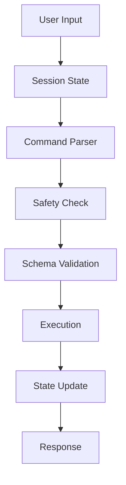

# N5 Core Architecture

## System Overview

N5 Core is a modular productivity operating system designed for Zo Computer that provides intelligent hiring and recruitment management through AI-assisted workflows.

## Design Principles

### 1. **Human-Readable First** (P1)
All data structures use human-readable formats (JSON, JSONL, Markdown) that can be edited manually or programmatically.

### 2. **Single Source of Truth** (P2)
Each piece of data has one authoritative location. Derived data is computed on-demand or cached with clear invalidation rules.

### 3. **Modular Design** (P20)
Components are loosely coupled with clear interfaces, allowing independent evolution and testing.

### 4. **Safety by Default** (P5, P7)
- Anti-overwrite protection
- Dry-run mode for destructive operations
- Schema validation before writes

## Core Components

### Session State Manager

**Purpose**: Track conversation context, objectives, and state across interactions

**Key Features**:
- Type-aware initialization (build/research/discussion/planning)
- Automatic system file loading
- State persistence across conversation sessions
- Progress tracking and objective management

**Usage**:
```bash
python3 /home/workspace/N5/scripts/session_state_manager.py init \
  --convo-id con_abc123 \
  --type build \
  --load-system
```

### Safety System

**Purpose**: Prevent data loss and validate operations before execution

**Key Features**:
- Pre-flight checks for destructive operations
- Schema validation
- Dry-run simulation
- Rollback capability

**Protection Rules**:
- No overwrites without explicit confirmation
- Validate file existence before operations
- Check for potential data conflicts

### Schema Validation

**Purpose**: Ensure data integrity across all N5 operations

**Key Schemas**:
- `commands.schema.json` - Command structure and metadata
- `lists.item.schema.json` - Action items and tasks
- `lists.registry.schema.json` - List catalogs
- `index.schema.json` - Knowledge indexing

## Data Flow



## File Organization

### Configuration Layer
- `config/commands.jsonl` - Command registry
- `config/settings.example.json` - User configuration template

### Schema Layer
- `schemas/*.json` - Data validation schemas
- Ensures consistency across all operations

### Script Layer
- `scripts/*.py` - Core execution logic
- Modular, testable, reusable

### Command Layer
- `commands/*.md` - Command definitions
- Human-readable documentation
- AI-parseable instructions

## Extension Points

### Adding New Commands

1. Define command in `commands/*.md`
2. Register in `config/commands.jsonl`
3. Implement execution logic in `scripts/`
4. Add tests

### Adding New Schemas

1. Create schema in `schemas/*.json`
2. Document in `docs/SCHEMAS.md`
3. Integrate validation in relevant scripts
4. Add test cases

## Error Handling

**Philosophy**: Fail fast, log comprehensively, recover gracefully

**Strategy**:
- Validate inputs early
- Log all operations with context
- Provide clear error messages
- Enable automatic rollback when possible

## Performance Considerations

- Lazy loading of configuration
- Caching with explicit invalidation
- Minimal context loading (P0, P8)
- Efficient file I/O patterns

## Security

- No external network calls from core scripts
- Sanitize all user inputs
- Validate file paths before operations
- Use type hints for static analysis

## Future Architecture Goals

- Plugin system for custom commands
- API for external integrations
- Event-driven architecture for real-time updates
- Distributed state for multi-user scenarios

## References

- `file '/home/workspace/Knowledge/architectural/architectural_principles.md'` - Full principles
- `file '/home/workspace/N5/prefs/prefs.md'` - Operational preferences
- `file '/home/workspace/Documents/N5.md'` - System documentation
